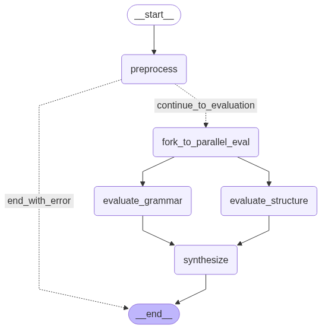
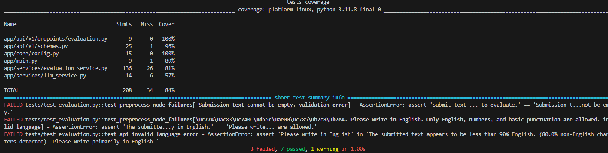

# AI Essay Evaluation System

FastAPI 기반 에세이 자동 평가 API. LangGraph를 통해 평가 파이프라인의 제어 흐름을 관리하고, Azure OpenAI `gpt-4o-mini`를 LLM으로 사용합니다

---

## 실행 환경 구성


### Build & Run
1.  **Repository Clone**
    
    ```bash
    git clone https://github.com/Big-Shu-Nim/essay_eval
    cd essay_eval
    ```
    

2.  **Environment Variables**
    `.env.example`을 `.env`로 복제 후, 필요한 값을 채워주세요 
    ```bash
    cp .env.example .env
    ```

3.  **Docker Compose**
    빌드 및 데몬 실행.
    ```bash
    docker compose up --build 
    ```
    - API Docs: `http://localhost:8000/docs`
    - http://localhost:8000/docs 에서 테스트

---


## API 사용 예시

API는 `http://localhost:8000/v1/essay-eval` 엔드포인트에 `POST` 요청을 보내는 방식으로 사용합니다. 

### 요청 (Request)

`curl`을 사용한 요청 예시는 다음과 같습니다. 

```bash

curl -X 'POST' \
  'http://localhost:8000/v1/essay-eval' \
  -H 'accept: application/json' \
  -H 'Content-Type: application/json' \
  -d '{
  "level_group": "intermediate",
  "topic_prompt": "Describe your dream vacation.",
  "submit_text": "I want to go to the beach. The weather is warm and I can swim in the sea. It will be a lot of fun because I like summer."
}'
```


## 아키텍처 및 설계 결정

LLM의 비결정성을 제어하고, 도메인 특화 규칙을 강제하기 위해 LangGraph 기반의 상태 머신(State Machine) 아키텍처를 채택하였습니다.

  
   

### 1. Pre-processing


-   **로직:**
    -   **Null/Empty Validation:** `level_group`, `submit_text`의 존재 여부를 체크.  그래프의 `error_message` 상태를 업데이트하고 `END`로 분기합니다.
    -   **Language Validation:** 정규식으로 영어 유뮤 확인을 하되 10%정도 의 임계값을 줘서 유연성 확보했습니다. 
    - 모든검사를 통과한경우 `word_count`와 `is_valid_language` 을 리턴합니다
    - 통과하지 못한경우 바로 `END` 로 종료합니다. 

### 2. processing 

-   **로직**
    -   **구조별 단계처리와 grammar를 병렬처리:**`fork_to_parallel_eval`노드를 생성해서 따로 진행합니다 

    -   **차등피드백:** 레벨별로 필요한 피드백도 달라야한다고 생각했습니다. 이에 `Core Focus`별로 다른 `Correction` 하도록 설계했습니다. 예를들어 `basic`은 `내용 명확성`을 토대로 하고  `intermediated`은 `근거&전개` 를 토대로 `Correction`을 생성합니다
 

### 3. Post-processing & Dynamic Scoring


-   **로직:**
    
    `synthesize` 노드에서 `grammar 노드`와 `structure노드`의 결과물을 결합하고 최종 점수를 재계산합니다  
    1.  **Core Issue Penalty:**
        -   `evaluate_structure` 단어수로만 가중치를 적용할때 변별력이 부족하다고 생각하여  LLM의 `corrections` 결과에서 레벨별 핵심 키워드(e.g., "reason", "evidence")의 존재 여부를 분석, `has_core_issue` 플래그를 State에 기록합니다다
        -   `synthesize` 노드는 이 플래그가 `True`일 경우, LLM이 부여한 점수에서 감점합니다.

    2.  **Word Count Penalty:**
        -   `preprocess`에서 계산된 `word_count`를 State를 통해 전달받고
        -   `level_group`별로 정의된 최소 단어 수 기준에 미달 시, 점수를 추가 차등 감점합니다.


---


## 테스트 코드

app/test-> test_evluation.py로 생성했습니다. 

